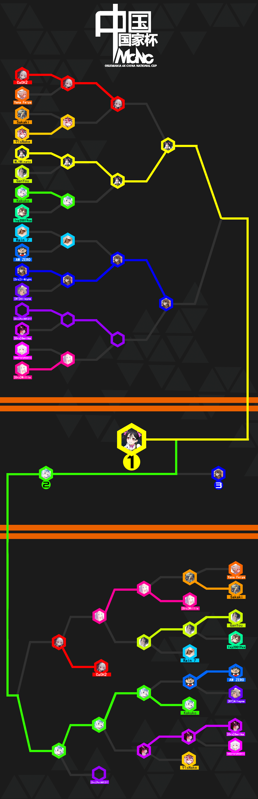

---
tags:
  - MCNC
  - MCNC2020
---

# osu!mania 4K Chinese National Cup 2020

The **osu!mania 4K Chinese National Cup 2020** (***MCNC 2020***) was a country-based osu!mania tournament hosted by the \[Crz\]Team. It was the second installment of the osu!mania 4K Chinese National Cup.

## Tournament schedule

| Event | Timestamp |
| --: | :-- |
| Registration phase | 2020-03-23/2020-04-12 |
| Qualifying Contest | 2020-04-27/2020-04-30 |
| Live drawings | 2020-05-01 20:00:00 UTC+8 |
| Group Stage - Week 1 | 2020-05-02/2020-05-10 |
| Group Stage - Week 2 | 2020-05-11/2020-05-17 |
| Round of 16 | 2020-05-18/2020-05-24 |
| Quarterfinals | 2020-05-25/2020-05-31 |
| Semifinals - Week 1 | 2020-06-01/2020-06-07 |
| Semifinals - Week 2 | 2020-06-08/2020-06-14 |
| Finals - Week 1 | 2020-06-15/2020-06-21 |
| Finals - Week 2 | 2020-06-22/2020-06-28 |

## Prizes

| Placing | Prizes |
| :-: | :-- |
|  | CNY 1,200, 15% off coupon of the New Crazyboard, profile badge, 4 months of osu!supporter tag |
|  | CNY 800, 10% off coupon of the New Crazyboard, profile badge, 2 months of osu!supporter tag |
|  | CNY 400, 5% off coupon of the New Crazyboard, profile badge, 1 months of osu!supporter tag |

## Organisation

The osu!mania 4K Chinese National Cup 2020 was run by various community members.

| Position | Members |
| :-- | :-- |
| Manager | ![][flag_CN] [\[Crz\]xz1z1z](https://osu.ppy.sh/users/10500832), ![][flag_NZ] [\[Crz\]NucleoAP](https://osu.ppy.sh/users/9237208), ![][flag_US] [dblade](https://osu.ppy.sh/users/4272841), ![][flag_CN] [crazybrother](https://osu.ppy.sh/users/8045083) |
| Map selector | ![][flag_CN] [\[Crz\]xz1z1z](https://osu.ppy.sh/users/10500832), ![][flag_CN] [Sillyp](https://osu.ppy.sh/users/4556538), ![][flag_CN] [\[Crz\]MemoryI](https://osu.ppy.sh/users/8179131), ![][flag_CN] [\[Crz\]Satori](https://osu.ppy.sh/users/7082178), ![][flag_MX] [\[Crz\]Noire](https://osu.ppy.sh/users/6031847), ![][flag_MX] [Plutes](https://osu.ppy.sh/users/11188249), ![][flag_MX] [\[OSC\]Amagai](https://osu.ppy.sh/users/9658070) |
| Streamer | ![][flag_CN] [\[Crz\]xz1z1z](https://osu.ppy.sh/users/10500832), ![][flag_CN] [crazybrother](https://osu.ppy.sh/users/8045083), ![][flag_CN] [\[Crz\]Satori](https://osu.ppy.sh/users/7082178), ![][flag_CN] [Rasis](https://osu.ppy.sh/users/1209363), ![][flag_CN] [Ayase Eli](https://osu.ppy.sh/users/6764156) |
| Commentator | ![][flag_CN] [\[Crz\]xz1z1z](https://osu.ppy.sh/users/10500832), ![][flag_CN] [\[Crz\]Satori](https://osu.ppy.sh/users/7082178), ![][flag_CN] [crazybrother](https://osu.ppy.sh/users/8045083), ![][flag_CN] [Rasis](https://osu.ppy.sh/users/1209363), ![][flag_CN] [Tamaki Iroha](https://osu.ppy.sh/users/11238501), ![][flag_CN] [\[Crz\]HDRoop_7](https://osu.ppy.sh/users/6336721), ![][flag_NZ] [\[Crz\]NucleoAP](https://osu.ppy.sh/users/9237208) |
| Designer | ![][flag_CN] [Dr\_Tissues](https://osu.ppy.sh/users/5106681) |
| Referee | ![][flag_CN] [\[Crz\]xz1z1z](https://osu.ppy.sh/users/10500832), ![][flag_CN] [\[Crz\]Satori](https://osu.ppy.sh/users/7082178), ![][flag_CN] [Another Flower](https://osu.ppy.sh/users/6854920), ![][flag_CN] [Sonoaoi](https://osu.ppy.sh/users/9755808), ![][flag_NZ] [\[Crz\]NucleoAP](https://osu.ppy.sh/users/9237208), ![][flag_CN] [crazybrother](https://osu.ppy.sh/users/8045083) |
| Statistician | ![][flag_CN] [Ayase Eli](https://osu.ppy.sh/users/6764156), ![][flag_CN] [\[Crz\]xz1z1z](https://osu.ppy.sh/users/10500832) |

## Links

- [Discussion thread (English)](https://osu.ppy.sh/community/forums/topics/1039317)
- [Discussion thread (Chinese)](https://osu.ppy.sh/community/forums/topics/1039326)
- [Livestream](https://live.bilibili.com/2996250)
- [Challonge bracket](https://challonge.com/zh_CN/MCNC2020)
- **[Statistics sheet](https://docs.google.com/spreadsheets/d/18a6ZwQ5Q_EWvncpfzP3KIYFB6IeOIWiC_AbqYpuORBE)**

## Participants

| Seed | Player |
| :-: | :-- |
| #1 | ![][flag_CN] [WLYMinato](https://osu.ppy.sh/users/12703319) |
| #2 | ![][flag_CN] [Kakuko](https://osu.ppy.sh/users/10413362) |
| #3 | ![][flag_CN] [\[Crz\]Serika](https://osu.ppy.sh/users/6701729) |
| #4 | ![][flag_CN] [\[Crz\]I-Night](https://osu.ppy.sh/users/8790619) |
| #5 | ![][flag_CN] [Rbpencil](https://osu.ppy.sh/users/8004085) |
| #6 | ![][flag_CN] [CaOH2](https://osu.ppy.sh/users/10702235) |
| #7 | ![][flag_CN] [91sNake](https://osu.ppy.sh/users/8726178) |
| #8 | ![][flag_CN] [ImmortalphoeniX](https://osu.ppy.sh/users/7080633) |
| #9 | ![][flag_CN] [lxy20019xs](https://osu.ppy.sh/users/7673726) |
| #10 | ![][flag_CN] [\[Illustrious\]](https://osu.ppy.sh/users/4082595) |
| #11 | ![][flag_CN] [gzdongsheng](https://osu.ppy.sh/users/8660315) |
| #12 | ![][flag_CN] [Kagaku](https://osu.ppy.sh/users/11178148) |
| #13 | ![][flag_CN] [Cloud18](https://osu.ppy.sh/users/15889859) |
| #14 | ![][flag_CN] [- xiaoluoli -](https://osu.ppy.sh/users/9502281) |
| #15 | ![][flag_HK] [Yana Feiya](https://osu.ppy.sh/users/7802517) |
| #16 | ![][flag_TW] [Timewasdeapsea](https://osu.ppy.sh/users/8682905) |
| #17 | ![][flag_TW] [Sakaki](https://osu.ppy.sh/users/2656856) |
| #18 | ![][flag_TW] [\[Crz\]FolAH1217](https://osu.ppy.sh/users/6232458) |
| #19 | ![][flag_CN] [\[ Emiya \]](https://osu.ppy.sh/users/4341197) |
| #20 | ![][flag_CN] [Hx\_032](https://osu.ppy.sh/users/11603156) |
| #21 | ![][flag_CN] [\[Crz\]Willis](https://osu.ppy.sh/users/6949941) |
| #22 | ![][flag_CN] [\[RT\]Alleyne](https://osu.ppy.sh/users/11279273) |
| #23 | ![][flag_CN] [Hidden is fun](https://osu.ppy.sh/users/10449071) |
| #24 | ![][flag_CN] [Edward\_Tsui](https://osu.ppy.sh/users/8609627) |
| #25 | ![][flag_CN] [CherryG](https://osu.ppy.sh/users/7719449) |
| #26 | ![][flag_TW] [AW ZERO](https://osu.ppy.sh/users/4415146) |
| #27 | ![][flag_CN] [yuwenhao1](https://osu.ppy.sh/users/14318312) |
| #28 | ![][flag_CN] [GODV14138](https://osu.ppy.sh/users/13756517) |
| #29 | ![][flag_CN] [Rain 7](https://osu.ppy.sh/users/9787146) |
| #30 | ![][flag_CN] [3032656057](https://osu.ppy.sh/users/13844875) |
| #31 | ![][flag_CN] [GanYou](https://osu.ppy.sh/users/10358203) |
| #32 | ![][flag_CN] [spensll](https://osu.ppy.sh/users/4547744) |

### Groups

| Group A | Group B | Group C | Group D | Group E | Group F | Group G | Group H |
| :-- | :-- | :-- | :-- | :-- | :-- | :-- | :-- |
| CaOH2 | Rain 7 | WLYMinato | \[Crz\]FolAH1217 | Kakuko | ImmortalphoeniX | Sakaki | Yana Feiya |
| \[RT\]Alleyne | 91sNake | \[Crz\]Willis | lxy20019xs | \[Crz\]Serika | GanYou | AW ZERO | Hx\_032 |
| CherryG | Rbpencil | gzdongsheng | Edward\_Tsui | yuwenhao1 | \[Illustrious\] | spensll | \[Crz\]I-Night |
| \[ Emiya \] | Timewasdeapsea | - xiaoluoli - | Cloud18 | Hidden is fun | GODV14138 | 3032656057 | Kagaku |

### Podium and bracket

This competition has come to an end and resulted in the following podium:

| Placing | Player |
| :-: | :-- |
|  | ![][flag_CN]  |
|  | ![][flag_CN]  |
|  | ![][flag_CN]  |

## Mappools

### Finals

**[Download the mappack here! (201MB)](https://www.dropbox.com/s/p4daduyfm4us6m4/MCNC20%20%E5%86%B3%E8%B5%9B%E5%9B%BE%E5%8C%85.rar?dl=0)**

- Freemod
  - [TAG underground overlay - Over The "Period" (Tidek) \[Edit\]](https://osu.ppy.sh/beatmaps/1777377)
  - [lapix - Carry me away (Couil) \[4K SV CHALLENGE\]](https://osu.ppy.sh/beatmaps/1271753)
  - [sky_delta - Precursor (Daughter-) \[antecedent\]](https://osu.ppy.sh/beatmaps/1791811)
  - [ck - Carnation (ck remix) (Gekido-) \[LN Master\]](https://osu.ppy.sh/beatmaps/1579095)
  - [Camelia - The King Of Lions (\[OSC\]Agami) \[Jungle Warfare\]](https://osu.ppy.sh/beatmaps/2094458)
  - [Inferi - Those Who From the Heavens Came (XeoStyle) \[Investiture of the Gods\]](https://osu.ppy.sh/beatmaps/897408)
  - [DJKurara - Steady Rock Kiss On Me (drunkenstein) \[Happiness\]](https://osu.ppy.sh/beatmaps/1682118)
  - [a\_hisa - Smoked Turkey Rag (\[Illustions\]) \[tournament?\]](https://osu.ppy.sh/beatmaps/2096435)
  - [aaaa vs Frums - beepbit \*\*\* futures (LeiN-) \[cosmonaut\]](https://osu.ppy.sh/beatmaps/1864667)
  - [Leaf - LeaF  Style Super Shredder II (Imperial Wolf) \[Shred everything\]](https://osu.ppy.sh/beatmaps/2100461)
  - [Lamberti phil - Alpha (\[Crz\]Zetsfy) \[Reincarnation\]](https://osu.ppy.sh/beatmaps/2046040)
  - [KopophobiA & Ajataa - Lunar Eclipse (\[Crz\]Zetsfy) \[Firanzia\]](https://osu.ppy.sh/beatmaps/1900586)
  - [orangentle - HAELEQUIN -the faith of truth- (\_underjoy) \[Shattered Personality\]](https://osu.ppy.sh/beatmaps/1512722)
  - [Quarks (kradness&Camellia) - Intro + Dualive (Evening) \[backpropogation\]](https://osu.ppy.sh/beatmaps/2084873)
  - [Camellia - NEURO-CLOUD-9 (Evening) \[GAUSSIAN (EVE.NING'S FLIP) x1.05\]](https://osu.ppy.sh/beatmaps/1884094)
- Tiebreaker
  - **[Unlucky Morpheus - Sono Tamashii Ni Yasuragi Wo \~ Dignity of Spirit (Evening) \[forever and never\]](https://osu.ppy.sh/beatmaps/2095156)**

### Semifinals

**[Download the mappack here! (189MB)](https://www.dropbox.com/s/joxo6t1cxgqakrl/MCNC20%20%E5%8D%8A%E5%86%B3%E8%B5%9B%E5%9B%BE%E5%8C%85.rar?dl=0)**

- Freemod
  - [Alfheim (Tidek) \[Freya\]](https://osu.ppy.sh/beatmaps/1966772)
  - [lapix - Foolish Hero (dionzz99) \[Fooled\]](https://osu.ppy.sh/beatmaps/1040762)
  - [U1 overground - Dopamine (juankristal) \[Polyethylene Oxide\]](https://osu.ppy.sh/beatmaps/1472944)
  - [SOUND HOLIC - WANNA BE CRAZY PRINCESS -  (\[OSC\]Amagai) \[/L/unatic Pri/N/cess\]](https://osu.ppy.sh/beatmaps/1860579)
  - [loz - Cinderella Cage -Trancecore Mix- (Kamikaze) \[Tail's vs Kami's Lunatic\]](https://osu.ppy.sh/beatmaps/2022076)
  - [Kobaryo - The Lightning Sword (AutotelicBrown) \[Ayumu's ascension\]](https://osu.ppy.sh/beatmaps/1576797)
  - [Fleshgod Apocalypse - The Fool (Couil) \[Mixleading Grace (new)\]](https://osu.ppy.sh/beatmaps/1701237)
  - [4k - SHD+ Package (1234567890) \[Tuk Tuk Boshi (Jump Hand+)\]](https://osu.ppy.sh/beatmaps/838065)
  - [SHK.o2SE - Death Moon (Guilhermeziat) \[Dawn of The Final Day\]](https://osu.ppy.sh/beatmaps/1412004)
  - [Terminal 11 - That's Gonna Be (Gekido-) \[Challenge\]](https://osu.ppy.sh/beatmaps/2051696)
  - [The Ghost of 3.13 - Forgotten (Shoegazer) \[Forgotten Collab\]](https://osu.ppy.sh/beatmaps/749258)
  - [-45 - Utan2 (976600146) \[-\]](https://osu.ppy.sh/beatmaps/1556704)
  - [Chroma - I (Guilhermeziat) \[You\]](https://osu.ppy.sh/beatmaps/1592359)
  - [gmtn. (witch's slave) - Daraku no Sono (shadowsnoop) \[Tumultu\]](https://osu.ppy.sh/beatmaps/1132175)
  - [Sullivan King & Matt McGuire - Lockdown (Feat.Sam King) (Song Hana) \[Declear an Emergency\]](https://osu.ppy.sh/beatmaps/1247641)
- Tiebreaker
  - **[aaaa - Hoshi wo Kakeru Adventure \~ we are forever friends! \~ \[Long ver.\] (Daikyi) \[Our Epilogue\]](https://osu.ppy.sh/beatmaps/1074892)**

### Quarterfinals

**[Download the mappack here! (156MB)](https://www.dropbox.com/s/09beh96ojmjnkzb/MCNC20%20%E5%9B%9B%E5%88%86%E4%B9%8B%E4%B8%80%E5%86%B3%E8%B5%9B%E5%9B%BE%E5%8C%85.rar?dl=0)**

- ModType
  - [Jameson Hodge - pn sqnc 518\[6\] (Couil) \[sv sqnc 518\[1\]\]](https://osu.ppy.sh/beatmaps/2037752)
  - [SickStrophe - Pop Up Tha Bass (Cokiiplay) \[Jump\]](https://osu.ppy.sh/beatmaps/1298710)
  - [Fall Out Boy - Thnks Fr Th Mmrs (Razzy) \[Thnks Fr Th Ndls\]](https://osu.ppy.sh/beatmaps/1563668)
  - [Freezer feat. Kiichigo - Berry Go!! (PiraTom) \[BERRY HARD\]](https://osu.ppy.sh/beatmaps/1432754)
  - [Etia. - On And On!! (Club Extended) \[Feat.Jenga\] (eZmmR) \[Raveille & eZmmR's LN Party!!\]](https://osu.ppy.sh/beatmaps/2068796)
  - [UNDEAD CORPORATION - Everything will freeze (riktoi) \[Benumb\]](https://osu.ppy.sh/beatmaps/1500546)
  - [SP-# - tinnitus (stupud man) \[Guil's Inundation\]](https://osu.ppy.sh/beatmaps/1636326)
  - [ATC - Around the World (Wh1teh) \[!!\]](https://osu.ppy.sh/beatmaps/1766006)
  - [The Brig & Umperia - Siren (Daybreak) \[Minty's Beginner\]](https://osu.ppy.sh/beatmaps/2078742)
  - [Terminal 11 - Miserable Bastard (Gekido-) \[Despair\]](https://osu.ppy.sh/beatmaps/1657803)
  - [nanobii - Rainbow Road (STAMINA KILLER CUT) (190-225BPM) (Worms) \[225BPM 4K Handstream\]](https://osu.ppy.sh/beatmaps/2079642)
  - [Camellia feat. Nanahira - EDM Jumpers ({E+H}DM Reboot) (Gekido-) \[{L+E}MON Reboot\]](https://osu.ppy.sh/beatmaps/1690577)
  - [MisoilePunch Takenoko Soe - Staring at star (SDMseven) \[HEAVENLY\]](https://osu.ppy.sh/beatmaps/1472933)
- Tiebreaker
  - **[AA... Hisui Chazuke... - Stardust Prism (Lude) \[Illumination\]](https://osu.ppy.sh/beatmaps/1589531)**

### Round of 16

**[Download the mappack here! (113MB)](https://www.dropbox.com/s/ie7xz0i9zw0d485/MCNC20%20RO16%E5%9B%BE%E5%8C%85.rar?dl=0)**

- ModType
  - [Frums - Wavetapper (qqqant) \[Stage 1: Memory Factory\]](https://osu.ppy.sh/beatmaps/1811863)
  - [stereoberry - evangelize (blurry images) (Tidek) \[transparency (SV)\]](https://osu.ppy.sh/beatmaps/1222765)
  - [Beltaine - Rockhill (Ryu Sei) \[Hard\]](https://osu.ppy.sh/beatmaps/994291)
  - [PROTODOME - Greatest Hat (Gekido-) \[chalLeNge\]](https://osu.ppy.sh/beatmaps/1759313)
  - [Frederic - oddloop (infilect) \[oldnep\]](https://osu.ppy.sh/beatmaps/1376904)
  - [eye burn - SHI\*A\*WA\*SE (Elekton) \[joy\]](https://osu.ppy.sh/beatmaps/1552444)
  - [wa. remixed by celas - Gin no Kaze (Elekton) \[mistral\]](https://osu.ppy.sh/beatmaps/1592941)
  - [Silentroom - Protoflicker (\[Crz\]Crysarlene) \[crysather\]](https://osu.ppy.sh/beatmaps/1954837)
  - [Aural Vampire - Shonan Zoku -Cannibal Coast- (Wh1teh) \[k\]](https://osu.ppy.sh/beatmaps/1158510)
  - [The Flashbulb - Chik Habit (Gekido-) \[Stage 4: Torment\]](https://osu.ppy.sh/beatmaps/1546411)
  - [Laur, Dustvoxx - FireLight (Neokontrol Remix) (Suu is my waifu) \[Enkindle\]](https://osu.ppy.sh/beatmaps/1708743)
  - [Soko ni Naru - Tenohira de Odoru (Vortex-) \[Sweaty Palms\]](https://osu.ppy.sh/beatmaps/1711260)
  - [Camellia - \*Feels Seasickness...\* (Suu is my waifu) \[\*Maximum...\*\]](https://osu.ppy.sh/beatmaps/1932640)
- Tiebreaker
  - **[goreshit - fleshbound (\[Crz\]NucleoAP) \[Couil's trapped\]](https://osu.ppy.sh/beatmaps/2075130)**

### Group Stage

**[Download the mappack here! (121MB)](https://www.dropbox.com/s/lqde07vuqftq579/MCNC20%20%E5%B0%8F%E7%BB%84%E8%B5%9B%E5%9B%BE%E5%8C%85.rar?dl=0)**

- Freemod
  - [Frums - Credits (BossModWolf) \[Glitched Tech Corp. (SV)\]](https://osu.ppy.sh/beatmaps/1985858)
  - [succducc - me & u (Couil) \[& sv\]](https://osu.ppy.sh/beatmaps/1442650)
  - [FELT - Life \[Eris's "a Fate Encounter" mix\] (\[OSC\]Amagai) \[Lunatic\]](https://osu.ppy.sh/beatmaps/1971029)
  - [Draw the Emotional & Foreground Eclipse - Stay by my side (Herkkupala) \[puxtu's Lunatic\]](https://osu.ppy.sh/beatmaps/968811)
  - [ARM - Saita, Kimi no Egao (Julie) \[I can Fly\]](https://osu.ppy.sh/beatmaps/967569)
  - [Various Artists - Chordial Blitz (DourGent) \[Venetian Drums - Sheenoboo\]](https://osu.ppy.sh/beatmaps/1703314)
  - [Joywave - Yolomania Selections (Daybreak) \[1.1x\]](https://osu.ppy.sh/beatmaps/2066048)
  - [BilliumMoto - life flashes before weeb eyes (Hydria) \[Tech\]](https://osu.ppy.sh/beatmaps/2041466)
  - [void - Just Hold On (LovelySerenade) \[Flawless Diversion (challenge)\]](https://osu.ppy.sh/beatmaps/1467814)
  - [Rengoku Teien - Suikyou Heaven (Kamikaze) \[Oriental // justhow x Kamikaze\]](https://osu.ppy.sh/beatmaps/1755454)
  - [Mick Gordon - Rip and tear (Herkkupala) \[Revenant\]](https://osu.ppy.sh/beatmaps/1970086)
- Tiebreaker
  - **[Kano - Stella-rium (DJ Noriken Bootleg) (Lude) \[Koneko's Celestial // 4K\]](https://osu.ppy.sh/beatmaps/1253374)**

### Qualifiers

**[Download the mappack here! (14.3MB)](https://www.dropbox.com/s/xwvugt6bvhy6d20/MCNC20%20%E8%B5%84%E6%A0%BC%E8%B5%9B%E5%9B%BE%E5%8C%85.rar?dl=0)**

- Nomod
  - [Frums - Credits (BossModWolf) \[Glitched Tech Corp. (SV)\]](https://osu.ppy.sh/beatmaps/1985858)
  - [succducc - me & u (Couil) \[& sv\]](https://osu.ppy.sh/beatmaps/1442650)
  - [FELT - Life \[Eris's "a Fate Encounter" mix\] (\[OSC\]Amagai) \[Lunatic\]](https://osu.ppy.sh/beatmaps/1971029)
  - [Draw the Emotional & Foreground Eclipse - Stay by my side (Herkkupala) \[puxtu's Lunatic\]](https://osu.ppy.sh/beatmaps/968811)
  
## Match results

### Finals

| Player 1 |  |  | Player 2 | Match link |
| --: | :-: | :-: | :-- | :-- |
| **\[Crz\]Murasame** | **7** | 3 | \[Crz\]FolAH1217 | [#1](https://osu.ppy.sh/community/matches/54022298) |
| \[Crz\]Satori | 1 | **7** | **\[Crz\]FolAH1217** | [#1](https://osu.ppy.sh/community/matches/54020340) |
| Stink God | 1 | **7** | **\[Crz\]FolAH1217** | [#1](https://osu.ppy.sh/community/matches/53828408) |
| **\[Crz\]FolAH1217** | **7** | 0 | tyrcs | [#1](https://osu.ppy.sh/community/matches/53661619) |
| **\[Crz\]Murasame** | **7** | 1 | \[Crz\]Satori | [#1](https://osu.ppy.sh/community/matches/53661063) |
| **Stink God** | **7** | 1 | Pureforever | [#1](https://osu.ppy.sh/community/matches/53636288) |

### Semifinals

| Player 1 |  |  | Player 2 | Match link |
| --: | :-: | :-: | :-- | :-- |
| **Pureforever** | **7** | 0 | Kakuko | *win by default* |
| **\[Crz\]Satori** | **7** | 4 | \[Crz\]FolAH1217 | [#1](https://osu.ppy.sh/community/matches/53331754) |
| **Kakuko** | **7** | 6 | \[Crz\]Serika | [#1](https://osu.ppy.sh/community/matches/53309484) |
| **Pureforever** | **7** | 1 | Ecivon | [#1](https://osu.ppy.sh/community/matches/53308594) |
| Stink God | 3 | **7** | **\[Crz\]Murasame** | [#1](https://osu.ppy.sh/community/matches/53307268) |
| \[RT\]Mrqianmo | 0 | 0 | \[Crz\]HDRoop_7 | *[fake match](https://osu.ppy.sh/community/matches/53304213)* |
| ImmortalphoeniX | 0 | **7** | **tyrcs** | *win by default* |

### Quarterfinals

| Player 1 |  |  | Player 2 | Match link |
| --: | :-: | :-: | :-- | :-- |
| ImmortalphoeniX | 0 | **6** | **\[Crz\]Murasame** | [#1](https://osu.ppy.sh/community/matches/53166697) |
| AradORiOn\_MMM | 0 | **6** | **Ecivon** | *win by default* |
| Kakuko | 1 | **6** | **\[Crz\]Satori** | [#1](https://osu.ppy.sh/community/matches/53163071) |
| **\[Crz\]FolAH1217** | **6** | 2 | Pureforever | [#1](https://osu.ppy.sh/community/matches/53147887) |
| **\[Crz\]HDRoop_7** | **6** | 0 | Lo\_liFish2000 | [#1](https://osu.ppy.sh/community/matches/53146211) |
| \[RT\]Alleyne | 0 | **6** | **tyrcs** | [#1](https://osu.ppy.sh/community/matches/53146151) |
| **Stink God** | **6** | 4 | \[RT\]Mrqianmo | [#1](https://osu.ppy.sh/community/matches/53145970) |
| **\[Crz\]Serika** | **6** | 1 | - xiaoluoli - | [#1](https://osu.ppy.sh/community/matches/53121165) |

### Round of 16

| Player 1 |  |  | Player 2 | Match link |
| --: | :-: | :-: | :-- | :-- |
| **\[Crz\]FolAH1217** | **6** | 3 | \[Crz\]HDRoop_7 | [#1](https://osu.ppy.sh/community/matches/53006585) |
| \[Crz\]Serika | 4 | **6** | **ImmortalphoeniX** | [#1](https://osu.ppy.sh/community/matches/53005544) |
| **Kakuko** | **6** | 1 | \[RT\]Alleyne | [#1](https://osu.ppy.sh/community/matches/53000811) |
| Ecivon | 1 | **6** | **\[RT\]Mrqianmo** | [#1](https://osu.ppy.sh/community/matches/52986431) |
| **Pureforever** | **6** | 1 | Lo\_liFish2000 | [#1](https://osu.ppy.sh/community/matches/52984756) |
| **\[Crz\]Satori** | **6** | 0 | tyrcs | [#1](https://osu.ppy.sh/community/matches/52982350) |
| AradORiOn\_MMM | 0 | **6** | **Stink God** | [#1](https://osu.ppy.sh/community/matches/52937821) |
| **\[Crz\]Murasame** | **6** | 1 | - xiaoluoli - | [#1](https://osu.ppy.sh/community/matches/52892266) |

### Group stage

| Player 1 |  |  | Player 2 | Match link |
| --: | :-: | :-: | :-- | :-- |
| ImmortalphoeniX | 0 | **5** | **\[Crz\]Satori** | [#1](https://osu.ppy.sh/community/matches/52732581) |
| \[Crz\]I-Night | 4 | **5** | **\[Crz\]FolAH1217** | [#1](https://osu.ppy.sh/community/matches/52787715) |
| Tamaki Iroha | 0 | **5** | **\[Crz\]Murasame** | [#1](https://osu.ppy.sh/community/matches/52813607) |
| snowkyou | 0 | **5** | **\[Crz\]Serika** | [#1](https://osu.ppy.sh/community/matches/52813517) |
| Tamaki Iroha | 1 | **5** | **\[RT\]Alleyne** | [#1](https://osu.ppy.sh/community/matches/52814260) |
| snowkyou | 1 | **5** | **tyrcs** | [#1](https://osu.ppy.sh/community/matches/52814391) |
| \[RT\]Alleyne | 1 | **5** | **\[Crz\]Murasame** | [#1](https://osu.ppy.sh/community/matches/52815303) |
| Ecivon | 1 | **5** | **AW ZERO** | [#1](https://osu.ppy.sh/community/matches/52815363) |
| **Ecivon** | **5** | 0 | \[Crz\]HDRoop_7 | *win by default* |
| **\[Crz\]Serika** | **5** | 3 | tyrcs | [#1](https://osu.ppy.sh/community/matches/52816796) |
| **Lo\_liFish2000** | **5** | 0 | LFWY | *win by default* |
| \[RT\]Mrqianmo | 1 | **5** | **\[Crz\]FolAH1217** | [#1](https://osu.ppy.sh/community/matches/52817851) |
| - xiaoluoli - | 1 | **5** | **Kakuko** | [#1](https://osu.ppy.sh/community/matches/52817901) |
| Stink God | 1 | **5** | **Pureforever** | [#1](https://osu.ppy.sh/community/matches/52818187) |
| AW ZERO | 0 | **5** | **\[Crz\]HDRoop_7** | [#1](https://osu.ppy.sh/community/matches/52836502) |
| Sakaki | 0 | **5** | **Kakuko** | *win by default* |
| **- xiaoluoli -** | **5** | 0 | Sakaki | *win by default* |
| Lo\_liFish2000 | 0 | **5** | **AradORiOn\_MMM** | [#1](https://osu.ppy.sh/community/matches/52845212) |
| LFWY | 0 | **5** | **AradORiOn\_MMM** | *win by default* |
| **\[RT\]Mrqianmo** | **5** | 2 | \[Crz\]I-Night | [#1](https://osu.ppy.sh/community/matches/52846150) |
| Namida KL | 0 | **5** | **\[Crz\]Satori** | *win by default* |
| Namida KL | 0 | **5** | **ImmortalphoeniX** | *win by default* |
| ying huo | 0 | **5** | **Stink God** | *win by default* |
| ying huo | 0 | **5** | **Pureforever** | *win by default* |
| ImmortalphoeniX | 0 | **5** | **\[Crz\]Satori** | [#1](https://osu.ppy.sh/community/matches/52732581) |
| \[Crz\]I-Night | 4 | **5** | **\[Crz\]FolAH1217** | [#1](https://osu.ppy.sh/community/matches/52787715) |
| Tamaki Iroha | 0 | **5** | **\[Crz\]Murasame** | [#1](https://osu.ppy.sh/community/matches/52813607) |
| snowkyou | 0 | **5** | **\[Crz\]Serika** | [#1](https://osu.ppy.sh/community/matches/52813517) |
| Tamaki Iroha | 1 | **5** | **\[RT\]Alleyne** | [#1](https://osu.ppy.sh/community/matches/52814260) |
| snowkyou | 1 | **5** | **tyrcs** | [#1](https://osu.ppy.sh/community/matches/52814391) |
| \[RT\]Alleyne | 1 | **5** | **\[Crz\]Murasame** | [#1](https://osu.ppy.sh/community/matches/52815303) |
| Ecivon | 1 | **5** | **AW ZERO** | [#1](https://osu.ppy.sh/community/matches/52815363) |
| **Ecivon** | **5** | 0 | \[Crz\]HDRoop_7 | *win by default* |
| **\[Crz\]Serika** | **5** | 3 | tyrcs | [#1](https://osu.ppy.sh/community/matches/52816796) |
| **Lo\_liFish2000** | **5** | 0 | LFWY | *win by default* |
| \[RT\]Mrqianmo | 1 | **5** | **\[Crz\]FolAH1217** | [#1](https://osu.ppy.sh/community/matches/52817851) |
| - xiaoluoli - | 1 | **5** | **Kakuko** | [#1](https://osu.ppy.sh/community/matches/52817901) |
| Stink God | 1 | **5** | **Pureforever** | [#1](https://osu.ppy.sh/community/matches/52818187) |
| AW ZERO | 0 | **5** | **\[Crz\]HDRoop_7** | [#1](https://osu.ppy.sh/community/matches/52836502) |
| Sakaki | 0 | **5** | **Kakuko** | *win by default* |
| **- xiaoluoli -** | **5** | 0 | Sakaki | *win by default* |
| Lo\_liFish2000 | 0 | **5** | **AradORiOn\_MMM** | [#1](https://osu.ppy.sh/community/matches/52845212) |
| LFWY | 0 | **5** | **AradORiOn\_MMM** | *win by default* |
| **\[RT\]Mrqianmo** | **5** | 2 | \[Crz\]I-Night | [#1](https://osu.ppy.sh/community/matches/52846150) |
| Namida KL | 0 | **5** | **\[Crz\]Satori** | *win by default* |
| Namida KL | 0 | **5** | **ImmortalphoeniX** | *win by default* |
| ying huo | 0 | **5** | **Stink God** | *win by default* |
| ying huo | 0 | **5** | **Pureforever** | *win by default* |

## Ruleset

### Tournament rules

1. This is a osu!mania head-to-head individual tournament for Chinese players.
2. This tourney will be using 4-key ScoreV2, and will have two stages: a double elimination group stage followed by a double elimination bracket stage. A qualifiers stage will be used should the player count for this tourney surpass 32 eligible players.
3. There is no limit on the number of the players that will enter. Any and all whom we deem as a "cheater" or "suspicious", screened by both the tourney and the official osu! staff, will not be allowed entry into the tournament. Note that failure to read the entire forum post during sign-up may cause the player to not be eligible until the issue is resolved, so please read the entire post first!
4. This tournament is for Chinese players only, including players from Mainland Chinese territories, Taiwan territories, Hong Kong territories, Macau territories. Please note that this tournament has nothing to do with politics and views about the territories of China. Only players with the flags of the territories listed above is eligible for playing.
5. The discord server will be the source of pretty much all the information for this tournament, so if you're joining, either as player, staff, or even as a spectator, you'll want to join for all of the latest updates. Players are required to join the official discord to be eligible of playing in the tournament. For those who cannot access discord, we have a QQ server containing the methods which could help you better access discord. QQ server number: 597317576.
6. For all of the details of the rules of the tourney, refer to the Information document here or in the discord channel. The discord channel and that document will have all the information you need, and the discord channel will be where future announcements will be made! So make sure you join the channel if you are participating.

### Tournament registration

1. There is no rank range for this tournament, players from all skill levels are free to participate.
2. To be eligible for playing, one must:
   - Have not been banned/majorly restricted in the past year.
   - Pass a background check by osu!staff and the tournament staff.
   - Include the answer "SETUgkd" in the question "Do you have anything else to say?"
3. Players need to have a live broadcast environment, if necessary, must be able to stream to show the hands.
4. We reserve the right to deny any and all suspicious accounts/players from participating in the tournament. Players must abide to the osu! terms of service.

### Stage instructions

1. In the first stage (Group Stage), the players will be divided into 8 groups of 4 players.
   - This may change depending on how many players are accepted into the competition at the end.
2. All the players from each group will face each other.
3. Rankings of each group are determined by sorting the results of each player's performance in the following priority:
   - Most matches won.
   - Have higher `{(the number of beatmaps won) - (the number of beatmaps defeated)}`.
   - Most beatmaps won.
   - **Winner of the match played previously between the tied players.**
   - In the event of a triple tie:
     - Have higher `∑{(total score difference) / (maximum score)}`.
     - Winner of the rematch.
4. The top 2 players of each group will move on to the knock-out stages.
   - This may change with the actual Group Stage setup.
5. Following stages are double elimination stages. This means that the winner moves on to the next stage and the losing player gets moved to the losers' bracket.
6. The **Winning conditions** for each stage will be:
   - In Group Stage, you need to win 5 beatmaps to win a match. (best of 9)
   - In the Round of 16 and the Quarterfinals, you need to win 6 beatmaps to win a match. (best of 11)
   - In Semifinals, **Finals and Grand Finals**, you need to win 7 beatmaps to win a match. (best of 13)

### Match instructions

1. A referee will create a multiplayer room 15 minutes in advance. Players must gather during this period. Room settings are osu!mania, Head-To-Head, Win Condition: "ScoreV2". Room name must be "MCNC: (Red) vs (Blue)".
2. Warmups during the Group Stages may not have a length higher than 5 minutes. Bracket Stages may be no longer than 6 minutes. Warmups are optional when allowed.
3. Players are allowed to ban 1 map each for each match alternating between the players with no restrictions except that each player must ban from mappool.
Before matches will start, the captain of each player will roll and the one with the highest roll will choose their warmup first (if they would like their warmup), pick maps from the mappool first and ban one map from the mappool second. Picks will alternate as well.
4. Players will be given at most 2 minutes for picking/banning each map. Players taking to long to make a ban/pick will result in losing their ban/pick. Continued stalling will result in the other player's banning/picking instead.
5. Players will be given at most 3 minutes for fielding the desired roster for the map. The map will start 3 minutes after the map has been chosen, with no exceptions barring technical issues.
6. For free mod picks, mod is optional for either of the player, with selectable mods being HD, FI, and FL.
7. Should both players be at match point, or in other words should both players be one point away from winning, the tiebreaker is played as the last map instead. The tiebreaker map shares the same rule as the free mod maps.
8. There are no restrictions on what a player can or cannot pick, with the exception that the map being picked must be from the mappool for that match, has not been picked during the match, and cannot have been banned prior to the pick phase.
9. In the event of a tie during a map, the map is to be replayed. Should the map need to be replayed more than twice, then the player who selected that map may select another map with the replayed map being banned for the rest of the match. Should the pool run out of eligible maps this way, any nonbanned map may be picked again, overruling the previous rule of "maps picked cannot have been picked during the match yet".
10. Both players are allowed to restart a map at most once due to disconnects and other technical issues if the map has not proceeded for 30 seconds or longer. Same mods and roster must be used should a restart commence. Please try to fix any and all issues as much as possible prior to the match.
11. The referees may nullify rules at their discretion if necessary, and have the final say in what occurs during the match.

[flag_CN]: /wiki/shared/flag/CN.gif "China"
[flag_HK]: /wiki/shared/flag/HK.gif "Hong Kong"
[flag_MX]: /wiki/shared/flag/MX.gif "Mexico"
[flag_NZ]: /wiki/shared/flag/NZ.gif "New Zealand"
[flag_TW]: /wiki/shared/flag/TW.gif "Taiwan"
[flag_US]: /wiki/shared/flag/US.gif "United States"
